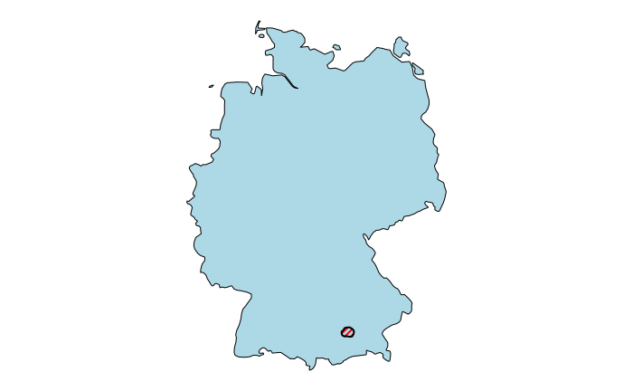

Query Polygon
================

Description Query any weather parameter for the selected polygon and
obtain mean, median, minimum or maximum values from the Meteomatics
Weather API

First you have to import the meteomatics module and the lubridate
library, the maps library is not necessary for the Query

``` r
suppressMessages(library(lubridate))
suppressMessages(library(MeteomaticsRConnector))
suppressMessages(library(maps))
```

Input here your username and password from your meteomatics profile

``` r
username <- "r-community"
password <- "Utotugode673"
```

Input here a startdate, an enddate and the time interval, all as class
POSIXct. The interval tells you, if you get the data in hourly steps,
daily steps or every five minutes in between the startdate and the
enddate.

``` r
time_zone <- "UTC"
startdate <- as.POSIXct(format(Sys.time()-hours(24), format="%Y-%m-%d %H:00:00"), tz=time_zone)
enddate <- as.POSIXct(format(Sys.time(), format="%Y-%m-%d %H:00:00"), tz=time_zone)

interval <- "PT1H"
```

Choose the parameters and model you want to get and write them in the
list. Check here which parameters are available:
<https://www.meteomatics.com/en/api/available-parameters/>

``` r
parameters <- list("t_2m:C", "dew_point_2m:C", "relative_humidity_2m:p", "precip_1h:mm")
```

The coordinates for the polygon can be either of these forms:
“47.3,9.3”, c(“47.3,9.3”, “47.43,9.4”) or list(c(47.3,9.3),
c(47.43,9.4))

For this example a rough Polygon for Munich has been created

``` r
coordinates <- list(list(c(48.22,11.454), c(48.23,11.56), c(48.23,11.62), c(48.21,11.66), c(48.20,11.69), c(48.17,11.74), c(48.14,11.76), c(48.09,11.75), c(48.03,11.70), c(48.02,11.61), c(48.03,11.54), c(48.03,11.47), c(48.03,11.42), c(48.04,11.38), c(48.06,11.34), c(48.11,11.32), c(48.14,11.33), c(48.16,11.37), c(48.18,11.40), c(48.21,11.42), c(48.22,11.45)))
```

To show the Polygon on a map you can use the “maps” library

``` r
coordinates_df <- as.data.frame(do.call(rbind, coordinates[[1]]))
colnames(coordinates_df) <- c("Latitude", "Longitude")

# Plot Germany map
germany_map <- map("world", regions = "Germany", fill = TRUE, col = "lightblue", bg = "white", mar = c(1,1,1,1))
# Plot the polygon
polygon(coordinates_df$Longitude, coordinates_df$Latitude, col = "red", border = "black", lwd = 2, density = 20)
```



Now you have the possibility to change some arguments for the query

``` r
# Select one of the following aggregates: min; max; mean; median; mode. In case of multiple polygons with different aggregators the number of aggregators and polygons must match and the operator has to be set to NULL!
aggregation <- "max"

 # Specify an operator. Can be either "D" (difference) or "U" (union). If more than one polygon is supplied, then the operator key has to be defined except if different aggregators for multiple polygons are selected
operator <- "U"

# A character vector containing the model of interest. The default value is NULL, meaning that the model mix is selected
model <- "mix"

# A character vector containing the ensembles of interest. The default value is NULL. Possible inputs are for example: "median"; "member:5"; "member:1-50"; "member:0"; "mean"; "quantile0.2"
ens_select <- NULL

# A character vector specifying the interpolation: The default value is NULL. A possible input is: "gradient_interpolation"
interp_select <- NULL
```

In the following, the request will start. If there is an error in the
request as for example a wrong parameter or a date that doesn’t exist,
you get a message.

``` r
polygon <- query_polygon(coordinates, startdate, enddate, interval, parameters,
                         aggregation, username, password, operator, model,
                         ens_select, interp_select, on_invalid = "fill_with_invalid",
                         calibrated = TRUE)
```

    ## Calling URL:
    ##  https://api.meteomatics.com/2024-06-16T16:00:00Z--2024-06-17T16:00:00Z:PT1H/t_2m:C,dew_point_2m:C,relative_humidity_2m:p,precip_1h:mm/48.22,11.454_48.23,11.56_48.23,11.62_48.21,11.66_48.2,11.69_48.17,11.74_48.14,11.76_48.09,11.75_48.03,11.7_48.02,11.61_48.03,11.54_48.03,11.47_48.03,11.42_48.04,11.38_48.06,11.34_48.11,11.32_48.14,11.33_48.16,11.37_48.18,11.4_48.21,11.42_48.22,11.45:max/csv?model=mix&on_invalid=fill_with_invalid&calibrated=TRUE

``` r
head(polygon)
```

    ##   station_id           validdate t_2m.C dew_point_2m.C relative_humidity_2m.p
    ## 1   polygon1 2024-06-16 16:00:00   23.8           12.1                   51.8
    ## 2   polygon1 2024-06-16 17:00:00   23.4           12.2                   54.4
    ## 3   polygon1 2024-06-16 18:00:00   23.4           13.0                   60.8
    ## 4   polygon1 2024-06-16 19:00:00   22.3           13.0                   79.2
    ## 5   polygon1 2024-06-16 20:00:00   19.4           13.7                   87.3
    ## 6   polygon1 2024-06-16 21:00:00   18.2           12.0                   95.0
    ##   precip_1h.mm
    ## 1         0.00
    ## 2         0.02
    ## 3         0.00
    ## 4         0.00
    ## 5         0.02
    ## 6         0.00

Now you can play around with the data

``` r
# Find the highest temperature in Munich
max_temp <- max(polygon$t_2m.C)
# accumulated precipitation within the Munich Polygon
acc_precipitation <- sum(polygon$precip_1h.mm)

print(paste0("Maximum Temperature: ", max_temp,"°C,  Accumulated Precipitation: ", acc_precipitation,"mm"))
```

    ## [1] "Maximum Temperature: 27.1°C,  Accumulated Precipitation: 5.27mm"
